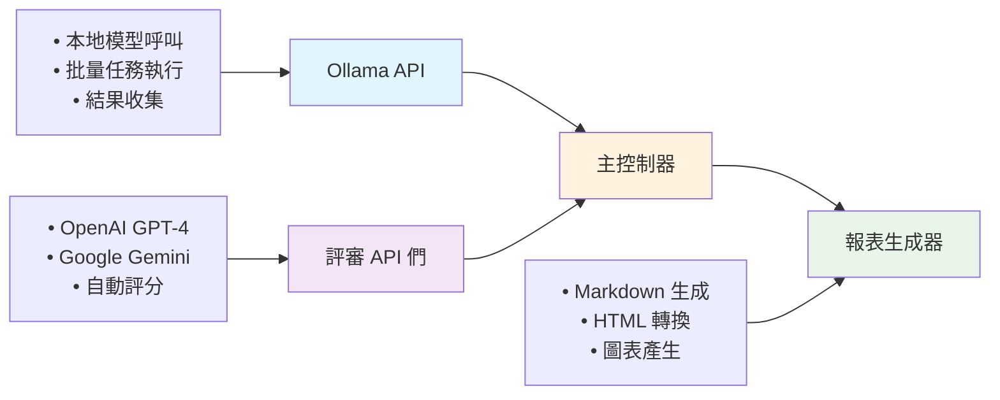

# 🤖 Ollama 模型評比系統

一個用於評比多個 Ollama 本地語言模型性能的自動化工具，透過雲端強大的評審模型（GPT-4 或 Gemini）來客觀評估各模型在不同任務上的表現。

## 📋 目錄

- [🎯 專案概述](#-專案概述)
- [✨ 主要功能](#-主要功能)
- [🚀 快速開始](#-快速開始)
- [⚙️ 設定說明](#️-設定說明)
- [📊 評比項目](#-評比項目)
- [🏆 評分標準](#-評分標準)
- [📈 報表輸出](#-報表輸出)
- [🛠️ 技術架構](#️-技術架構)
- [📁 專案結構](#-專案結構)
- [🔧 故障排除](#-故障排除)
- [🤝 貢獻指南](#-貢獻指南)

## 🎯 專案概述

本專案旨在建立一個客觀、自動化的 Ollama 語言模型評比系統。透過讓多個本地模型執行相同的任務，並使用雲端的強大模型（如 GPT-4、Gemini）作為評審，來獲得公正的性能評估結果。

### 🔍 評比方式
- **評審模型**：使用 GPT-4 或 Gemini 等雲端強大模型作為評審
- **評比任務**：文本摘要（Summarize）與英中翻譯（Translate）
- **輸出語言**：繁體中文（zh-TW）
- **評分範圍**：1-10 分制

## ✨ 主要功能

### 🔄 自動化評比流程
- 📖 自動讀取測試樣本
- 🤖 批量執行多個 Ollama 模型
- ⚖️ 使用多重評審模型評分
- 📊 生成詳細的比較報表

### 🎛️ 高度可配置
- 📝 透過 `config.py` 輕鬆調整設定
- 🔧 支援自訂提示詞和評分標準
- 🆕 可擴展新的評比任務
- 🔀 靈活的模型組合選擇

### 📈 豐富的報表功能
- 📊 詳細的評分表格
- 📈 視覺化長條圖比較
- 📉 統計分析和排名
- 🌐 Markdown + HTML 雙格式輸出

## 🚀 快速開始

### 1️⃣ 環境準備

```bash
# 安裝必要的 Python 套件
pip install requests opencc matplotlib numpy markdown pymdown-extensions
```

### 2️⃣ 設定配置

```bash
# 複製範例設定檔
cp config.py.example config.py

# 編輯設定檔，填入您的 API 金鑰和模型清單
nano config.py
```

### 3️⃣ 準備測試樣本

確保 [`input.txt`](input.txt) 包含您要測試的文本內容。

### 4️⃣ 執行評比

```bash
# 執行主程式
python main.py
```

### 5️⃣ 查看結果

```bash
# 檢視 Markdown 報表
cat reports/evaluation_report.md

# 在瀏覽器中查看 HTML 報表
open reports/evaluation_report.html
```

## ⚙️ 設定說明

### 📋 config.py 主要設定項目

```python
# Ollama API 設定
OLLAMA_API_BASE_URL = "http://localhost:11434"

# 待評比的模型清單
OLLAMA_MODELS_TO_COMPARE = [
    "llama3.1:latest",
    "gemma3:27b", 
    "gemma3:8b",
    "gemma3:12b",
    "hf.co/mradermacher/Llama-Breeze2-8B-Instruct-Text-GGUF:Q4_K_M"
]

# API 金鑰設定
OPENAI_API_KEY = "your_openai_api_key_here"
GOOGLE_API_KEY = "your_google_api_key_here"

# 評審模型設定
REVIEWER_MODELS = {
    "openai": "gpt-4o-mini",  # 或 gpt-4
    "gemini": "gemini-1.5-flash-latest"  # 或其他 Gemini 模型
}

# 支援的評比任務
SUPPORTED_TASKS = {
    "summarize": "請為以下文本產生一份專業的會議摘要...",
    "translate": "請將以下英文文本翻譯為繁體中文..."
}
```

### 🔑 API 金鑰取得方式

#### OpenAI API
1. 前往 [OpenAI Platform](https://platform.openai.com/api-keys)
2. 建立新的 API 金鑰
3. 將金鑰填入 `config.py` 的 `OPENAI_API_KEY`

#### Google Gemini API  
1. 前往 [Google AI Studio](https://makersuite.google.com/app/apikey)
2. 建立新的 API 金鑰
3. 將金鑰填入 `config.py` 的 `GOOGLE_API_KEY`

## 📊 評比項目

### 📝 摘要任務 (Summarize)
- **目標**：為會議記錄或長文本產生簡潔摘要
- **評估重點**：重點涵蓋、條理清晰、簡潔性
- **輸入**：英文會議記錄
- **輸出**：繁體中文摘要

### 🌐 翻譯任務 (Translate)  
- **目標**：將英文文本翻譯為繁體中文
- **評估重點**：通順性、準確性、專業術語處理
- **輸入**：英文技術文檔
- **輸出**：繁體中文翻譯

## 🏆 評分標準

### 📊 翻譯評分標準（1-10分）

| 項目 | 分數範圍 | 評估內容 |
|------|----------|----------|
| **通順性** | 1-4分 | 翻譯是否自然流暢，符合中文表達習慣 |
| **準確性** | 1-4分 | 是否有翻譯錯誤、遺漏或誤解 |
| **專業術語處理** | 1-2分 | 英文專業術語是否適當保留 |

### 📝 摘要評分標準（1-10分）

| 項目 | 分數範圍 | 評估內容 |
|------|----------|----------|
| **重點涵蓋** | 1-4分 | 重要議題和關鍵成果是否有提及 |
| **表達清楚** | 1-4分 | 摘要是否條理分明、易於理解 |
| **簡潔性** | 1-2分 | 是否避免冗餘，切中要點 |

## 📈 報表輸出

### 📄 Markdown 報表功能
- ✅ 模型評分表格
- ✅ 詳細評語記錄  
- ✅ 統計分析數據
- ✅ 完整的模型輸出結果

### 🌐 HTML 報表功能
- ✅ 美觀的網頁格式
- ✅ 支援 Mermaid 圖表
- ✅ 響應式設計
- ✅ 易於分享和查閱

### 📊 圖表分析
- 📈 各模型分數比較長條圖
- 📉 任務表現對比圖
- 📊 統計分析圖表

## 🛠️ 技術架構

### 🏗️ 核心組件



### 🔧 技術特色
- **🔗 API 整合**：同時整合 Ollama、OpenAI、Google APIs
- **⚡ 異步處理**：批量處理多個模型避免阻塞
- **🛡️ 錯誤處理**：完整的異常處理和重試機制
- **📊 資料處理**：使用 matplotlib 和 numpy 進行數據分析

### 📚 主要依賴套件
- `requests` - API 呼叫
- `opencc` - 繁簡轉換
- `matplotlib` - 圖表生成
- `numpy` - 數值計算
- `markdown` - Markdown 處理
- `pymdown-extensions` - Mermaid 支援

## 📁 專案結構

```
EvaluateModels/
├── 📄 README.md                    # 專案說明文件
├── 📄 AGENT.md                     # 開發需求文件  
├── ⚙️ config.py.example            # 設定檔範例
├── ⚙️ config.py                    # 實際設定檔（使用者建立）
├── 📖 input.txt                    # 測試樣本文件
├── 🚀 main.py                      # 主程式入口
├── 🔧 translator_ollama.py         # Ollama API 工具函數
├── 🌐 markdown2html.py             # HTML 轉換工具
├── 🗂️ reports/                    # 報表輸出目錄
│   ├── 📊 evaluation_report.md     # Markdown 報表
│   ├── 🌐 evaluation_report.html   # HTML 報表  
│   ├── 📈 chart_openai.png         # OpenAI 評審圖表
│   └── 📈 chart_gemini.png         # Gemini 評審圖表
├── 🗂️ __pycache__/                # Python 快取目錄
└── 📄 .gitignore                   # Git 忽略檔案設定
```

## 🔧 故障排除

### ❌ 常見問題

#### 🔗 API 連接失敗
```bash
ERROR: Ollama API 呼叫失敗
```
**解決方案**：
1. 確認 Ollama 服務正在運行：`ollama serve`
2. 檢查 `OLLAMA_API_BASE_URL` 設定是否正確
3. 確認網路連接正常

#### 🔑 API 金鑰錯誤
```bash
ERROR: OpenAI API 失敗 - 401 Unauthorized
```
**解決方案**：
1. 檢查 API 金鑰是否正確設定
2. 確認 API 金鑰是否已過期
3. 檢查 API 配額是否足夠

#### 🤖 模型不存在
```bash
ERROR: model 'llama3.1:latest' not found
```
**解決方案**：
1. 使用 `ollama list` 查看可用模型
2. 使用 `ollama pull <model_name>` 下載所需模型
3. 更新 `config.py` 中的模型清單

### 🐛 除錯模式

在 [`main.py`](main.py) 中新增除錯輸出：

```python
import logging
logging.basicConfig(level=logging.DEBUG)
```

## 🤝 貢獻指南

歡迎貢獻程式碼、報告問題或建議改進！

### 📝 貢獻方式
1. 🍴 Fork 本專案
2. 🌿 建立功能分支：`git checkout -b feature/新功能`
3. 💾 提交變更：`git commit -am '新增新功能'`
4. 📤 推送分支：`git push origin feature/新功能`
5. 🔄 建立 Pull Request

### 🆕 新增評比任務

在 `config.py` 的 `SUPPORTED_TASKS` 中新增：

```python
SUPPORTED_TASKS = {
    "summarize": "...",
    "translate": "...", 
    "your_new_task": "your_prompt_here"  # 新任務
}
```

同時在 [`main.py`](main.py) 的評分邏輯中新增對應的評分標準。

### 🔧 新增評審模型

在 `config.py` 的 `REVIEWER_MODELS` 中新增：

```python
REVIEWER_MODELS = {
    "openai": "gpt-4o-mini",
    "gemini": "gemini-1.5-flash-latest",
    "your_new_reviewer": "your_model_name"  # 新評審模型
}
```

---

## 📜 授權條款

本專案採用 MIT 授權條款。詳細內容請參閱 [LICENSE](LICENSE.md) 檔案。

## 🙏 致謝

感謝以下開源專案的支持：
- [Ollama](https://ollama.ai/) - 本地語言模型運行平台
- [OpenAI](https://openai.com/) - GPT 模型 API 服務  
- [Google AI](https://ai.google/) - Gemini 模型 API 服務
- [OpenCC](https://github.com/BYVoid/OpenCC) - 中文繁簡轉換工具

---

<div align="center">

**🎯 立即開始評比您的 Ollama 模型！**

[📖 使用說明](#-快速開始) | [⚙️ 設定指南](#️-設定說明) | [🤝 問題回報](https://github.com/yourusername/EvaluateModels/issues)

</div>